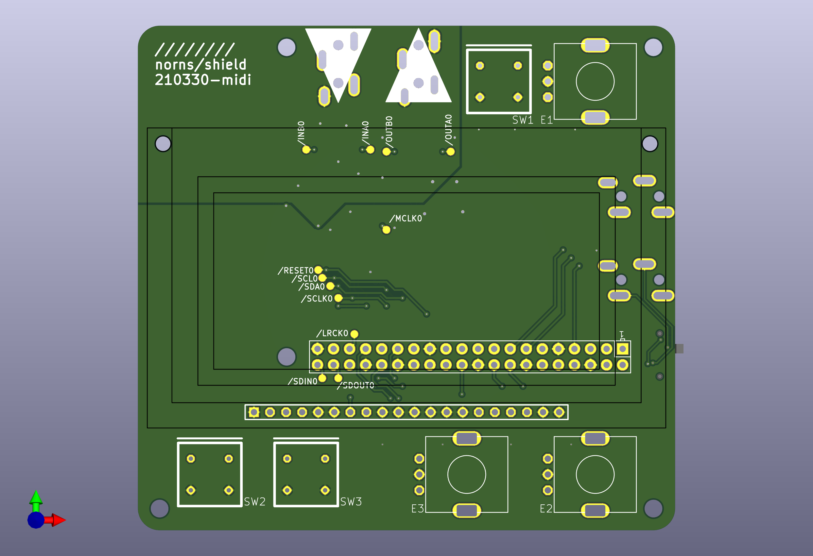

# norns-shield-midi

norns shield variant with hardware MIDI in/out ([TRS minijack connectors](https://minimidi.world/)), based on the 210330 version of the original [norns shield](https://github.com/monome/norns-shield)

also:
- PCB files ported to kicad
- board outline cleaned up a bit (slightly smaller? probably won't matter)
- MIDI in works with Type-A or Type-B (circuit based on [LPZW auto-crossover MIDI input](https://github.com/kay-lpzw/LPZW_TRS_MIDI), same as shieldXL i think?)
- MIDI out has a switch to choose between Type-A and Type-B

## getting one

this design is currently untested but boards are on the way to me. once i get them, finish assembly, and test one, i'll (try to remember to) update this page. 

i'll have a few extra boards (with SMT components assembled), if you're interested in buying one from me for cost of parts+shipping feel free to reach out - discord username is same as github username, and i'm @m04 on lines
